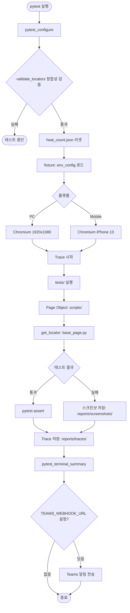
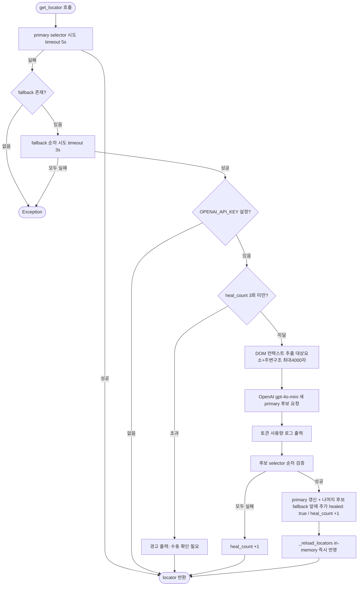

# Playwright Python Test Framework

Selenium에서 Playwright로 전환한 Python 기반 E2E 테스트 프레임워크입니다.  
Page Object Model + Self-Healing Locator + OpenAI 기반 자동 복구를 지원합니다.

---

## 목차

1. [흐름도](#흐름도)
2. [아키텍처](#아키텍처)
3. [설치](#설치)
4. [실행](#실행)
5. [Fixture](#fixture)
6. [Locator 관리](#locator-관리)
7. [Self-Healing](#self-healing)
8. [validate_locators](#validate_locators)
9. [실패 대응](#실패-대응)
10. [리포트 및 알림](#리포트-및-알림)
11. [새 페이지 추가](#새-페이지-추가)
12. [향후 개선 계획](#향후-개선-계획)

---

## 흐름도

### 전체 테스트 실행 흐름



### Locator 탐색 및 Self-Healing 흐름



---

## 아키텍처

```
project/
├── conftest.py              # 공통 hook: 스크린샷, Teams webhook, locator 검증, pytest 옵션
├── env.json                 # QA/Prod × PC/Mobile/Android/iOS 환경별 설정
├── locators.json            # 웹 selector 중앙 관리 (primary/fallback/healed)
├── validate_locators.py     # locators.json 정합성 검증 스크립트
├── self_healing.py          # OpenAI(gpt-4o-mini) 기반 웹 self-healing
├── pytest.ini               # pytest 기본 옵션
├── requirements.txt         # 버전 고정
├── tests/                   # 웹 테스트 케이스 (pytest assertion만, Playwright 문법 없음)
│   ├── conftest.py          # Playwright fixture: page (function), session_page (session)
│   └── test_login.py
├── tests_app/               # 앱 테스트 케이스 (Appium)
│   ├── conftest.py          # Appium fixture: 앱 종료/실행, 스플래시 대기, app_driver
│   ├── test_connection.py   # 디바이스 연결 및 앱 실행 확인
│   └── test_main.py         # 앱 메인화면 테스트
├── scripts/                 # 웹 Page Object (Playwright 액션 담당)
│   ├── base_page.py         # 웹 공통 액션 + self-healing 연동
│   └── login_page.py
├── scripts_app/             # 앱 Page Object (Appium 액션 담당)
│   ├── base_app_page.py     # Appium 공통 액션 + app-healing 연동 + stale retry
│   ├── main_page.py         # 메인화면 Page Object
│   └── food_list_page.py    # 음식배달 목록 Page Object
├── tests_app/
│   ├── conftest.py          # Appium fixture
│   ├── test_connection.py   # 디바이스 연결 및 앱 실행 확인
│   ├── test_main.py         # 앱 메인화면 테스트
│   └── test_categories.py   # API 기반 카테고리 탭 테스트
├── tools/                   # 개발/검증 도구 (pytest 수집 대상 아님)
│   ├── check_context.py     # DOM 컨텍스트 추출 및 OpenAI 후보 품질 검증
│   └── api_client.py        # 배민 Gateway API 클라이언트 (카테고리 목록 조회)
├── app_locators.json        # 앱 selector 중앙 관리 (primary/fallback/healed)
├── app_self_healing.py      # OpenAI(gpt-4o-mini) 기반 앱 self-healing (XML)
├── .env.example             # 환경변수 템플릿
└── appium.config.json       # Appium 서버 설정
```

### 핵심 설계 원칙

| 레이어 | 역할 | 사용 문법 |
|---|---|---|
| `tests/` | 웹 검증 로직 | `assert`, pytest only |
| `tests_app/` | 앱 검증 로직 | `assert`, pytest only |
| `scripts/` | Playwright 액션 (클릭/입력/탐색) | `BasePage` 상속 |
| `scripts_app/` | Appium 액션 (탭/입력/탐색) | `BaseAppPage` 상속 |
| `locators.json` | 웹 selector 중앙 관리 | primary / fallback / healed |
| `app_locators.json` | 앱 selector 중앙 관리 | primary / fallback / healed |

- **tests/, tests_app/** 에는 Playwright/Appium 문법 직접 사용 금지
- **scripts/** 의 모든 웹 Page Object는 `BasePage`를 상속
- **scripts_app/** 의 모든 앱 Page Object는 `BaseAppPage`를 상속
- selector는 코드 안에 하드코딩하지 않고 **locators.json / app_locators.json** 에서 관리

---

## 설치

```bash
# .venv 생성 및 활성화
python3 -m venv .venv
source .venv/bin/activate      # macOS/Linux
.venv\Scripts\activate         # Windows

pip3 install -r requirements.txt
playwright install chromium
```

---

## 실행

### 웹 테스트

```bash
# 기본 (QA 환경, PC)
pytest tests/

# 환경 / 플랫폼 지정
pytest tests/ --env=prod --platform=mo

# 헤드리스 모드
pytest tests/ --headless=true

# 병렬 실행 (pytest-xdist)
pytest tests/ -n auto

# 단일 파일 / 특정 테스트
pytest tests/test_login.py
pytest tests/ -k "test_login_success"
```

### 앱 테스트 (Appium)

```bash
# 기본 (QA 환경, Android)
pytest tests_app/

# iOS / Prod
pytest tests_app/ --app-os=ios --env=prod
```

| 옵션 | 값 | 기본값 | 대상 |
|---|---|---|---|
| `--env` | `qa` \| `prod` | `qa` | 웹 + 앱 공통 |
| `--platform` | `pc` \| `mo` | `pc` | 웹 전용 |
| `--headless` | `true` \| `false` | `false` | 웹 전용 |
| `--app-os` | `android` \| `ios` | `android` | 앱 전용 |

---

## Fixture

conftest.py는 역할에 따라 3개 파일로 분리되어 있습니다.

| 파일 | 역할 |
|---|---|
| `conftest.py` (루트) | 공통 hook — 실패 스크린샷, Teams webhook, locator 검증, 옵션 정의 |
| `tests/conftest.py` | Playwright fixture — `page`, `session_page` |
| `tests_app/conftest.py` | Appium fixture — `app_driver` |

### `page` (function scope) — 기본

테스트마다 새 브라우저 컨텍스트를 생성합니다.  
xdist 병렬 실행 시 worker 간 충돌이 없어 **대부분의 테스트에 권장**합니다.

```python
def test_example(page):
    login_page = LoginPage(page)
    ...
```

### `session_page` (session scope) — 로그인 유지

전체 테스트 세션 동안 브라우저를 유지합니다.  
**로그인 상태를 이어서 사용해야 하는 테스트**에서 선택적으로 사용합니다.

```python
def test_after_login(session_page):
    my_page = MyPage(session_page)
    ...
```

> xdist와 함께 session scope를 사용하면 worker 간 브라우저 공유가 불가능하므로 주의하세요.

### `app_driver` (function scope) — Appium

테스트마다 Appium driver를 생성하고 종료합니다.  
`--app-os` 옵션으로 Android/iOS를 지정합니다.

fixture 내부 동작:
1. 앱 실행 상태 확인 (`query_app_state`)
2. 실행 중이면 종료 (`terminate_app`)
3. 앱 실행 (`activate_app`)
4. 스플래시 화면 소멸 대기 (`EC.invisibility_of_element_located`)

```python
def test_tap_pizza(app_driver):
    page = MainPage(app_driver)
    page.tap_pizza()
    page.tap_back()
```

---

## Locator 관리

`locators.json`에서 모든 selector를 중앙 관리합니다.

### 구조

```json
{
  "login": {
    "submit_btn": {
      "primary": "role=button[name='로그인']",
      "fallback": ["button.btn.em.big", ".btn_wrap.mt16 button"],
      "previous": null,
      "healed": false
    }
  }
}
```

| 필드 | 설명 |
|---|---|
| `primary` | 기본으로 사용하는 selector |
| `fallback` | primary 실패 시 순서대로 시도 (string 또는 array) |
| `previous` | healing 전 원래 selector (자동 기록) |
| `healed` | healing으로 변경된 경우 `true` — PR 전 수동 검토 필요 |

### Selector 우선순위

```
#id > role=button[name=...] > role=textbox[name=...] > css(정적 class)
```

- `#id`가 존재하면 최우선 사용 (가장 안정적)
- 버튼/링크처럼 텍스트가 있는 요소는 `role=` 기반 selector 우선
- `data-v-*` 등 **빌드 툴이 자동 생성하는 속성은 사용하지 않음** (빌드마다 해시값 변경)
- `disable`, `active`, `focus`, `hover` 등 **상태에 따라 변하는 동적 class는 사용하지 않음**

### 동적 텍스트 — `{value}` 플레이스홀더

```json
{ "by_text": { "primary": "text={value}", ... } }
```

```python
login_page.click("common", "by_text", value="다음")
```

### Locator 탐색 흐름

```
primary 시도 (5초 timeout)
    ✅ 성공 → 반환
    ❌ 실패 → fallback[0] 시도 (3초 timeout)
                 ✅ 성공 → [OPENAI_API_KEY 있을 때] self-healing
                 │              └─ 새 primary 갱신
                 │              └─ 나머지 후보 → fallback 앞에 추가
                 │          → 반환
                 ❌ 실패 → fallback[1] 시도 ...
                              ❌ 모두 실패 → Exception
```

---

## Self-Healing

`OPENAI_API_KEY` 환경변수가 설정된 경우 자동으로 활성화됩니다.

### 동작 방식

1. `primary` selector 실패 → `fallback` selector로 요소 확보
2. DOM 컨텍스트 추출 — `[대상 요소]` HTML + `[주변 구조]` (부모 3단계) 분리 전달, 최대 4000자
3. OpenAI(gpt-4o-mini)에 새 selector 후보 3개 요청 ("대상 요소의 selector만 제안" 명시)
4. 후보를 순서대로 검증 → 첫 번째로 동작하는 selector를 새 `primary`로 저장
5. 나머지 후보는 `fallback` 배열 앞에 추가 (기존 fallback은 뒤에 유지, 중복 제거)
6. `healed: true` 플래그 기록 + in-memory locator 즉시 리로드

**healing 후 locators.json 변화 예시**

```json
// 전: primary 깨진 상태
{
  "primary": "#input03",
  "fallback": ["role=textbox[name='아이디(이메일계정)']"]
}

// 후: OpenAI가 ["#input01", "role=textbox[name='아이디를 입력해 주세요']"] 제안
{
  "primary": "#input01",
  "fallback": [
    "role=textbox[name='아이디를 입력해 주세요']",  // OpenAI 나머지 후보 (앞에 추가)
    "role=textbox[name='아이디(이메일계정)']"        // 기존 fallback 유지
  ],
  "previous": "#input03",
  "healed": true
}
```

### 제한

- 동일 요소에 최대 **3회** healing 시도 (`.heal_count.json`으로 관리)
- `.heal_count.json`은 **테스트 세션 시작 시 자동 리셋** (`pytest_configure`)
- healing 성공 시 `healed: true` → **PR 전 반드시 수동 검토**

### 비용

실제 로그인 페이지 기준 (gpt-4o-mini):

| 항목 | 수치 |
|---|---|
| input tokens | ~477 (DOM 최적화 후, 기존 ~1,686 대비 72% 절감) |
| output tokens | ~35 |
| 1회 비용 | $0.0001 미만 |

하루 100회 healing이 발생해도 **$0.01 이하**.  
selector는 자주 바뀌지 않으므로 실제 비용은 훨씬 적습니다.

### 운영 가이드

| 환경 | 권장 방식 |
|---|---|
| 로컬 / 소규모 팀 | 현재 방식 (자동 heal + 즉시 적용) |
| CI/CD / 팀 규모 확장 | heal은 제안만, 수동 승인 후 적용 |

CI 환경에서는 `locators.json`이 테스트 중 수정되면 git diff가 항상 발생하고,  
xdist 병렬 실행 시 race condition 가능성이 있습니다.  
팀 규모가 커지면 heal 결과를 `healed_suggestions.json`에만 기록하고  
사람이 검토 후 `locators.json`에 반영하는 흐름으로 전환을 권장합니다.

---

## validate_locators

테스트 시작 전 `pytest_configure`에서 **자동 실행**됩니다.  
실패 시 테스트 전체를 중단합니다.

```bash
# 수동 실행
python3 validate_locators.py
```

### 검증 항목

| 항목 | 내용 |
|---|---|
| JSON 형식 | 파싱 오류 감지 |
| 필수 필드 | `primary`, `previous`, `healed` 존재 여부 |
| 동적 locator | `text=` 사용 시 `{value}` 포함 여부 |
| fallback 형식 | 빈 문자열, null 등 유효하지 않은 fallback 감지 |
| fallback 경고 | `text=` fallback의 strict mode 위반 가능성 경고 |
| scripts/ 참조 | `self.locators["section"]["key"]` 패턴이 locators.json에 존재하는지 확인 |

---

## 실패 대응

### 스크린샷 자동 저장

테스트 실패 시 `reports/screenshots/{test_name}.png` 에 자동 저장됩니다.

### Trace 자동 저장

모든 테스트 종료 후 `reports/traces/trace.zip` 에 저장됩니다.

```bash
# Trace Viewer로 열기
playwright show-trace reports/traces/trace.zip
```

네트워크 요청, DOM 스냅샷, 스크린샷을 타임라인으로 확인할 수 있습니다.

---

## 리포트 및 알림

### HTML / Allure 리포트

```bash
# HTML 리포트
pytest tests/ --html=reports/report.html --self-contained-html

# Allure 리포트
pytest tests/ --alluredir=allure-results
allure serve allure-results
```

### Teams 알림

테스트 완료 후 결과를 Teams webhook으로 자동 전송합니다.

```bash
export TEAMS_WEBHOOK_URL="https://..."
```

전송 내용: 전체/통과/실패/오류 건수 + 상태 아이콘 (✅/❌)

### 환경변수 정리

```bash
export OPENAI_API_KEY="sk-..."          # self-healing 활성화
export TEAMS_WEBHOOK_URL="https://..."  # 테스트 결과 Teams 전송
export TEST_EMAIL="user@hanatour.com"   # 로그인 성공 테스트용
export TEST_PASSWORD="password"         # 로그인 성공 테스트용
```

---

## 새 페이지 추가

1. `locators.json`에 새 섹션 추가
2. `scripts/`에 Page Object 클래스 작성 (`BasePage` 상속)
3. `tests/`에 테스트 케이스 작성 (`assert` 만 사용)
4. `python3 validate_locators.py`로 정합성 확인

### 예시

**locators.json**
```json
{
  "search": {
    "keyword_input": {
      "primary": "#searchInput",
      "fallback": ["role=textbox[name='검색어 입력']"],
      "previous": null,
      "healed": false
    }
  }
}
```

**scripts/search_page.py**
```python
from scripts.base_page import BasePage

class SearchPage(BasePage):
    def search(self, keyword: str):
        self.fill("search", "keyword_input", keyword)
        self.click("search", "submit_btn")

    def get_result_count(self) -> int:
        return int(self.get_text("search", "result_count"))
```

**tests/test_search.py**
```python
from scripts.search_page import SearchPage

def test_search_returns_results(page):
    # page fixture가 env_config["base_url"]로 이동한 상태로 전달됨
    search = SearchPage(page)
    search.search("하와이")
    assert search.get_result_count() > 0
```

---

## 향후 개선 계획

상세 작업 목록 및 현황 평가는 **[TODO.md](./TODO.md)** 를 참고하세요.

| # | 항목 | 상태 | 설명 |
|---|---|---|---|
| 1 | DOM Context 최적화 | ✅ 완료 | 대상 요소 + 주변 구조 분리 전달, 토큰 72% 절감 — [docs/dom_context_optimization.md](./docs/dom_context_optimization.md) |
| 2 | xdist race condition 대응 | 미완 | 병렬 실행 시 locators.json 동시 쓰기 문제 해결 (filelock) |
| 3 | Teams heal 알림 | 미완 | healing 발생 시 Teams에 요소명 + 변경 내역 별도 전송 |
| 4 | Appium 확장 | ✅ 완료 | `BaseAppPage`, `app_self_healing.py`, `app_locators.json`, 스플래시 대기 — [docs/appium_setup.md](./docs/appium_setup.md) |
| 5 | API 기반 테스트 데이터 | ✅ 완료 | Gateway API 응답으로 카테고리 목록 동적 조회 → content-desc 자동 생성 → 순차 탭 테스트 (`tools/api_client.py`) |
| 6 | 테스트 커버리지 확대 | 미완 | 소셜 로그인, 아이디 저장 체크박스, 에러 메시지 텍스트 검증 등 |
