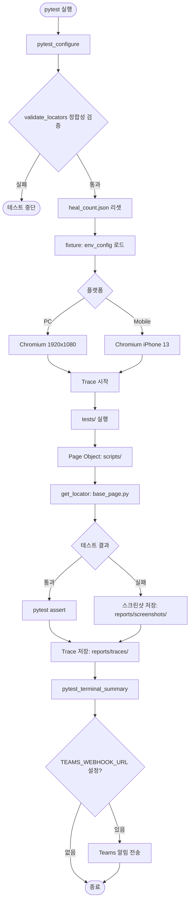
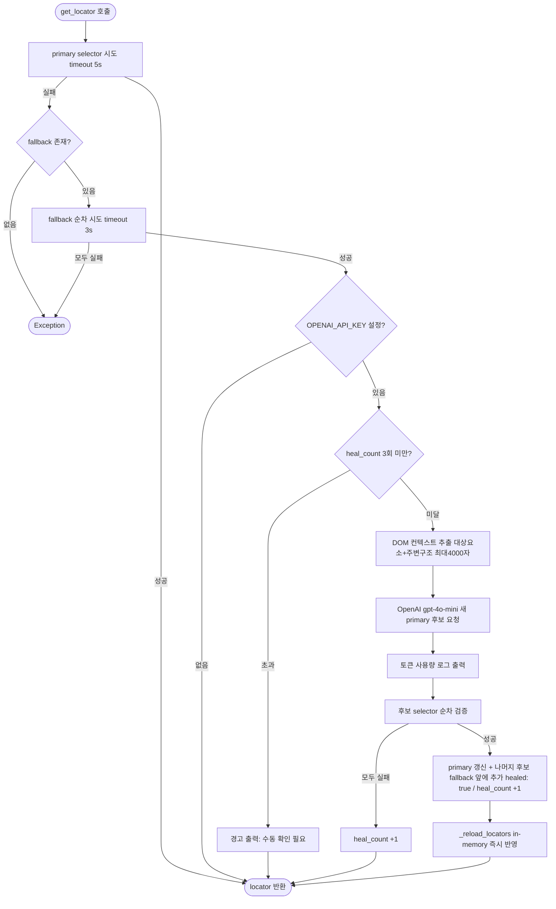

# 상세 문서

## 목차

1. [흐름도](#흐름도)
2. [아키텍처](#아키텍처)
3. [Fixture](#fixture)
4. [Locator 관리](#locator-관리)
5. [Self-Healing](#self-healing)
6. [validate_locators](#validate_locators)
7. [실패 대응](#실패-대응)
8. [리포트 및 알림](#리포트-및-알림)
9. [새 페이지 추가](#새-페이지-추가)
10. [향후 개선 계획](#향후-개선-계획)

---

## 흐름도

### 전체 테스트 실행 흐름



### Locator 탐색 및 Self-Healing 흐름



---

## 아키텍처

```
project/
├── conftest.py              # 공통 hook: 스크린샷, Teams webhook, locator 검증, pytest 옵션
├── env.json                 # QA/Prod × PC/Mobile/Android/iOS 환경별 설정
├── locators.json            # 웹 selector 중앙 관리 (primary/fallback/healed)
├── validate_locators.py     # locators.json 정합성 검증 스크립트
├── self_healing.py          # OpenAI(gpt-4o-mini) 기반 웹 self-healing
├── pytest.ini               # pytest 기본 옵션
├── requirements.txt         # 버전 고정
├── tests/                   # 웹 테스트 케이스 (pytest assertion만, Playwright 문법 없음)
│   ├── conftest.py          # Playwright fixture: page (function), session_page (session)
│   ├── test_home.py         # 메인화면 테스트 (prod 전용)
│   └── test_login.py
├── tests_app/               # 앱 테스트 케이스 (Appium)
│   ├── conftest.py          # Appium fixture: 앱 종료/실행, 스플래시 대기, app_driver
│   ├── test_connection.py   # 디바이스 연결 및 앱 실행 확인
│   ├── test_main.py         # 앱 메인화면 테스트
│   └── test_categories.py   # API 기반 카테고리 탭 테스트
├── scripts/                 # 웹 Page Object (Playwright 액션 담당)
│   ├── base_page.py         # 웹 공통 액션 + self-healing 연동
│   ├── home_page.py         # 메인화면 Page Object
│   └── login_page.py
├── scripts_app/             # 앱 Page Object (Appium 액션 담당)
│   ├── base_app_page.py     # Appium 공통 액션 + app-healing 연동 + stale retry
│   ├── main_page.py         # 메인화면 Page Object
│   └── food_list_page.py    # 음식배달 목록 Page Object
├── tools/                   # 개발/검증 도구 (pytest 수집 대상 아님)
│   ├── check_context.py       # DOM 컨텍스트 추출 및 OpenAI 후보 품질 검증
│   ├── api_client.py          # 배민 Gateway API 클라이언트 (카테고리 목록 조회)
│   └── generate_locator.py    # URL + 요소 설명 → locators.json 자동 등록 (웹 전용)
├── app_locators.json        # 앱 selector 중앙 관리 (primary/fallback/healed)
├── app_self_healing.py      # OpenAI(gpt-4o-mini) 기반 앱 self-healing (XML)
├── .env.example             # 환경변수 템플릿
└── appium.config.json       # Appium 서버 설정
```

### 핵심 설계 원칙

| 레이어 | 역할 | 사용 문법 |
|---|---|---|
| `tests/` | 웹 검증 로직 | `assert`, pytest only |
| `tests_app/` | 앱 검증 로직 | `assert`, pytest only |
| `scripts/` | Playwright 액션 (클릭/입력/탐색) | `BasePage` 상속 |
| `scripts_app/` | Appium 액션 (탭/입력/탐색) | `BaseAppPage` 상속 |
| `locators.json` | 웹 selector 중앙 관리 | primary / fallback / healed |
| `app_locators.json` | 앱 selector 중앙 관리 | primary / fallback / healed |

---

## Fixture

| 파일 | 역할 |
|---|---|
| `conftest.py` (루트) | 공통 hook — 실패 스크린샷, Teams webhook, locator 검증, 옵션 정의 |
| `tests/conftest.py` | Playwright fixture — `page`, `session_page` |
| `tests_app/conftest.py` | Appium fixture — `app_driver` |

### `page` (function scope)

테스트마다 새 브라우저 컨텍스트를 생성합니다. xdist 병렬 실행 시 worker 간 충돌이 없어 대부분의 테스트에 권장합니다.

### `session_page` (session scope)

전체 테스트 세션 동안 브라우저를 유지합니다. 로그인 상태를 이어서 사용해야 하는 테스트에서 선택적으로 사용합니다.

> xdist와 함께 session scope를 사용하면 worker 간 브라우저 공유가 불가능하므로 주의하세요.

### `app_driver` (function scope)

테스트마다 Appium driver를 생성하고 종료합니다. `--app-os` 옵션으로 Android/iOS를 지정합니다.

fixture 내부 동작:
1. 앱 실행 상태 확인 (`query_app_state`)
2. 실행 중이면 종료 (`terminate_app`)
3. 앱 실행 (`activate_app`)
4. 스플래시 화면 소멸 대기 (`EC.invisibility_of_element_located`)

---

## Locator 관리

### 구조

```json
{
  "login": {
    "submit_btn": {
      "primary": "role=button[name='로그인']",
      "fallback": ["button.btn.em.big", ".btn_wrap.mt16 button"],
      "previous": null,
      "healed": false
    }
  }
}
```

| 필드 | 설명 |
|---|---|
| `primary` | 기본으로 사용하는 selector |
| `fallback` | primary 실패 시 순서대로 시도 |
| `previous` | healing 전 원래 selector (자동 기록) |
| `healed` | healing으로 변경된 경우 `true` — PR 전 수동 검토 필요 |

### Selector 우선순위

```
#id > role=button[name=...] > role=textbox[name=...] > css(정적 class)
```

- `data-v-*` 등 빌드 툴 자동 생성 속성 사용 금지
- `disable`, `active` 등 상태에 따라 변하는 동적 class 사용 금지

---

## Self-Healing

`OPENAI_API_KEY` 환경변수가 설정된 경우 자동으로 활성화됩니다.

### 동작 방식

1. `primary` selector 실패 → `fallback` selector로 요소 확보
2. DOM 컨텍스트 추출 — 대상 요소 + 주변 구조 분리 전달, 최대 4000자
3. OpenAI(gpt-4o-mini)에 새 selector 후보 3개 요청
4. 후보를 순서대로 검증 → 첫 번째로 동작하는 selector를 새 `primary`로 저장
5. `healed: true` 플래그 기록 + in-memory locator 즉시 리로드

### 비용

실제 로그인 페이지 기준 (gpt-4o-mini):

| 항목 | 수치 |
|---|---|
| input tokens | ~477 (DOM 최적화 후, 기존 ~1,686 대비 72% 절감) |
| output tokens | ~35 |
| 1회 비용 | $0.0001 미만 |

---

## validate_locators

테스트 시작 전 `pytest_configure`에서 자동 실행됩니다.

```bash
python3 validate_locators.py
```

| 항목 | 내용 |
|---|---|
| JSON 형식 | 파싱 오류 감지 |
| 필수 필드 | `primary`, `previous`, `healed` 존재 여부 |
| fallback 형식 | 빈 문자열, null 등 유효하지 않은 fallback 감지 |
| scripts/ 참조 | `self.locators["section"]["key"]` 패턴이 locators.json에 존재하는지 확인 |

---

## 실패 대응

### 스크린샷 자동 저장

테스트 실패 시 `reports/screenshots/{test_name}.png` 에 자동 저장됩니다.

### Trace 자동 저장

```bash
playwright show-trace reports/traces/trace.zip
```

---

## 리포트 및 알림

```bash
# HTML 리포트
pytest tests/ --html=reports/report.html --self-contained-html

# Allure 리포트
pytest tests/ --alluredir=allure-results
allure serve allure-results
```

Teams webhook 설정 시 테스트 완료 후 결과를 자동 전송합니다 (전체/통과/실패 건수).

---

## 새 페이지 추가

1. `locators.json`에 새 섹션 추가
2. `scripts/`에 Page Object 클래스 작성 (`BasePage` 상속)
3. `tests/`에 테스트 케이스 작성 (`assert` 만 사용)
4. `python3 validate_locators.py`로 정합성 확인

---

## 향후 개선 계획

| # | 항목 | 상태 | 설명 |
|---|---|---|---|
| 1 | DOM Context 최적화 | ✅ 완료 | 토큰 72% 절감 |
| 2 | Appium 확장 | ✅ 완료 | Android/iOS 앱 테스트 지원 |
| 3 | API 기반 테스트 데이터 | ✅ 완료 | Gateway API 응답으로 동적 테스트 데이터 생성 |
| 4 | Locator 사전 생성 도구 | ✅ 완료 | URL + 요소 설명 → selector 자동 생성 → locators.json 등록 (웹 전용) |
| 5 | xdist race condition 대응 | 미완 | 병렬 실행 시 locators.json 동시 쓰기 문제 (filelock) |
| 6 | Teams heal 알림 | 미완 | healing 발생 시 Teams에 변경 내역 전송 |
| 7 | 테스트 커버리지 확대 | 미완 | 소셜 로그인, 에러 메시지 검증 등 |
